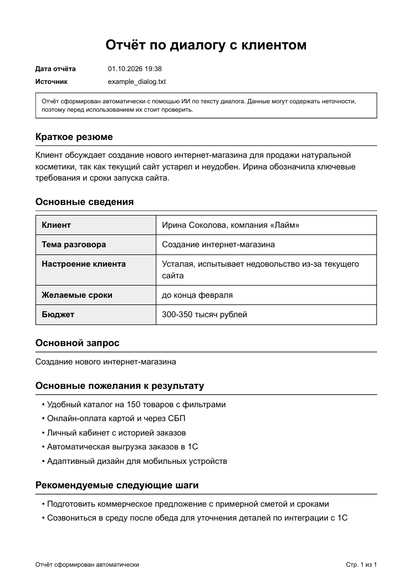
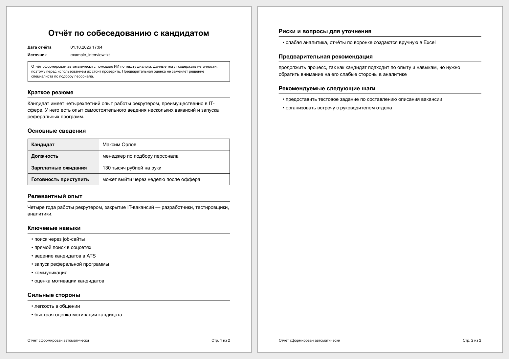

# AI Report Generator: из диалога в PDF-отчёт

Домашнее задание к уроку 10 (программа «HR-архитектор и Вайб-кодер»): проект принимает текст диалога, отправляет его в ИИ, получает структурированный JSON, подставляет данные в HTML-шаблон и сохраняет готовый PDF-отчёт с помощью WeasyPrint.

## Схема работы

```
текст диалога (.txt) -> ИИ (OpenAI) -> JSON с фиксированными полями
    -> Jinja2 подставляет данные в HTML-шаблон -> WeasyPrint -> PDF в папке reports/
```

## Что умеет проект

- Принимает диалог из текстового файла (UTF-8, UTF-16 и cp1251 читаются автоматически) или с клавиатуры.
- Просит модель вернуть строго структурированный JSON; ответ проверяется и приводится к единой структуре: все поля на месте, типы верные, лишнее отбрасывается.
- Два типа отчётов (второй тип - необязательная часть задания):
  - `client` - отчёт по диалогу с клиентом: клиент, тема, резюме, основной запрос, настроение, сроки, бюджет, пожелания, следующие шаги;
  - `interview` - отчёт по собеседованию с кандидатом: резюме, опыт, навыки, сильные стороны, риски, зарплатные ожидания, готовность приступить, предварительная рекомендация, следующие шаги.
- Единое оформление всех отчётов: общий базовый шаблон (`base.html`), общие блоки (`macros.html`), шрифт Arial, чёрный текст, колонтитулы с нумерацией страниц.
- Каждый отчёт сохраняется в `reports/` с датой и временем в имени файла.
- Обработка ошибок на каждом этапе с понятными сообщениями и журналом в файле `report_generator.log`.

## Примеры результата

Клиентский отчёт (по `examples/example_dialog.txt`):



Отчёт по собеседованию (по `examples/example_interview.txt`):



Готовые PDF лежат в папке `examples/`: `example_report_client.pdf` и `example_report_interview.pdf`.

## Структура проекта

```
ai_report_generator/
├── main.py                  # запуск: чтение диалога, вызов этапов, обработка ошибок
├── config.py                # настройки из .env
├── report_types.py          # типы отчётов: поля, роль ИИ, шаблон; приведение данных к структуре
├── utils/
│   ├── ai_processor.py      # запрос к модели, разбор JSON
│   └── pdf_generator.py     # подстановка данных в шаблон (Jinja2), создание PDF (WeasyPrint)
├── templates/
│   ├── base.html            # общий каркас и стили
│   ├── macros.html          # общие блоки (абзац, список)
│   ├── report_client.html   # шаблон клиентского отчёта
│   └── report_interview.html# шаблон отчёта по собеседованию
├── examples/                # примеры диалогов и готовые PDF
├── reports/                 # сюда сохраняются новые отчёты
├── screenshots/             # картинки для README
├── requirements.txt
├── .env.example
└── .gitignore
```

## Установка и запуск

1. Создать виртуальное окружение и установить библиотеки (Windows PowerShell):

```
python -m venv .venv
.\.venv\Scripts\Activate.ps1
pip install -r requirements.txt
```

2. Проверить, что WeasyPrint работает (на Windows ему нужны графические библиотеки Pango, подробности - в [документации WeasyPrint](https://doc.courtbouillon.org/weasyprint/stable/first_steps.html)):

```
python -m weasyprint --info
```

3. Скопировать `.env.example` в `.env` и вписать ключ OpenAI:

```
Copy-Item .env.example .env
```

4. Создать отчёт:

```
python main.py examples/example_dialog.txt
python main.py examples/example_interview.txt --type interview
```

Готовый PDF появится в папке `reports/`. Список типов отчётов: `python main.py --list-types`. Свой диалог можно передать любым текстовым файлом, а `python main.py -` читает текст с клавиатуры (завершить ввод: Ctrl+Z и Enter).

## Настройки (файл .env)

- `OPENAI_API_KEY` - ключ OpenAI
- `OPENAI_BASE_URL` - адрес API (по умолчанию `https://api.openai.com/v1`)
- `OPENAI_MODEL` - модель (по умолчанию `gpt-4o-mini`)
- `MAX_INPUT_CHARS` - максимальная длина диалога в символах (по умолчанию 60000)
- `LOG_LEVEL` - уровень журнала (по умолчанию `INFO`)

Ключ хранится только в `.env`, файл исключён из репозитория через `.gitignore`.

## Как добавить новый тип отчёта

1. В `report_types.py` описать новый тип: заголовок, роль ИИ, список полей (имя, описание и тип: строка или список).
2. Создать HTML-шаблон в `templates/` по образцу существующих (``).
3. Запустить `python main.py файл.txt --type новый_тип`. Промпт для модели собирается из описания полей автоматически.

## Обработка ошибок и журнал

- Журнал пишется в консоль и в файл `report_generator.log`: этапы 1-4 (чтение, ИИ, шаблон, PDF), расход токенов, ошибки.
- Проверяются и объясняются понятным сообщением: файл не найден или пустой, текст слишком длинный, неверный тип отчёта, не заполнены настройки, ошибка запроса к модели, ответ модели не удалось разобрать как JSON (делается вторая попытка), ошибка в шаблоне, PDF не создан (например, файл открыт в другой программе).
- Если ответ модели неполный, недостающие поля заполняются значением «Не указано», а в списках остаются только непустые элементы.

## Безопасность и ограничения

- Текст от ИИ вставляется в HTML с автоэкранированием (Jinja2), поэтому он не может «сломать» разметку; текст диалога в промпте помечен как данные, а не инструкции.
- Ответы модели могут содержать неточности: в каждый отчёт добавлено примечание, что данные нужно проверять. Предварительная рекомендация в отчёте по собеседованию не заменяет решение специалиста.
- Диалоги в `examples/` вымышленные. Настоящие персональные данные кандидатов и клиентов без их согласия в сторонние сервисы отправлять не стоит.
- Расход токенов при проверке: клиентский отчёт - около 1060-1070 токенов (вход 798), отчёт по собеседованию - 1206 токенов, около 6 секунд на отчёт.
- Не реализовано: вставка изображений, сгенерированных ИИ (генерация изображений платная), и веб-интерфейс.